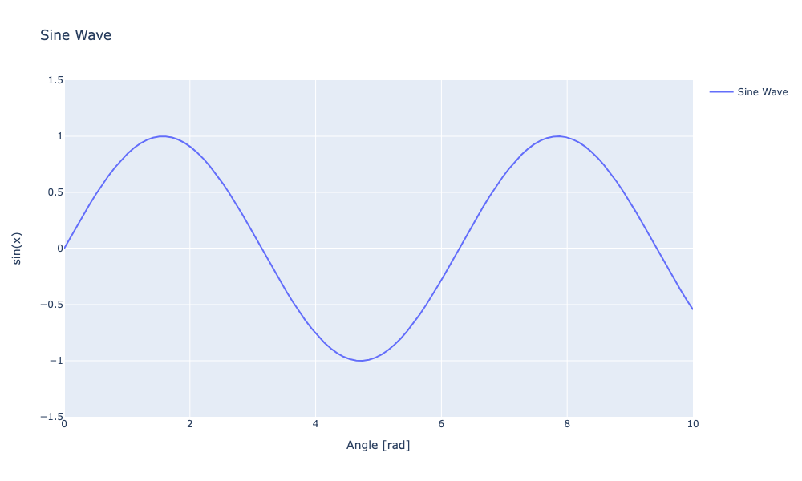
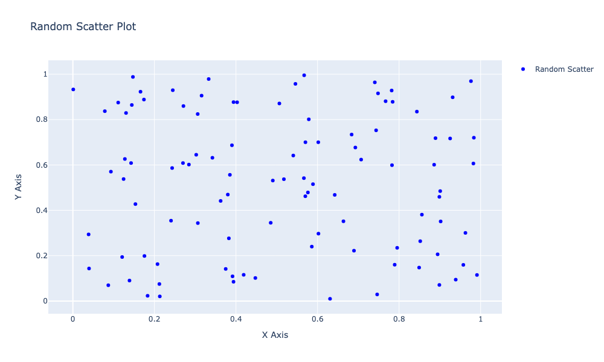
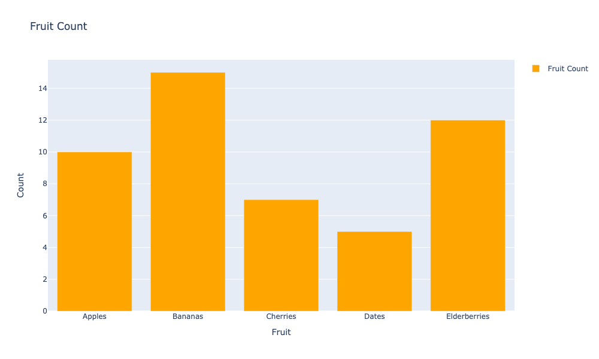
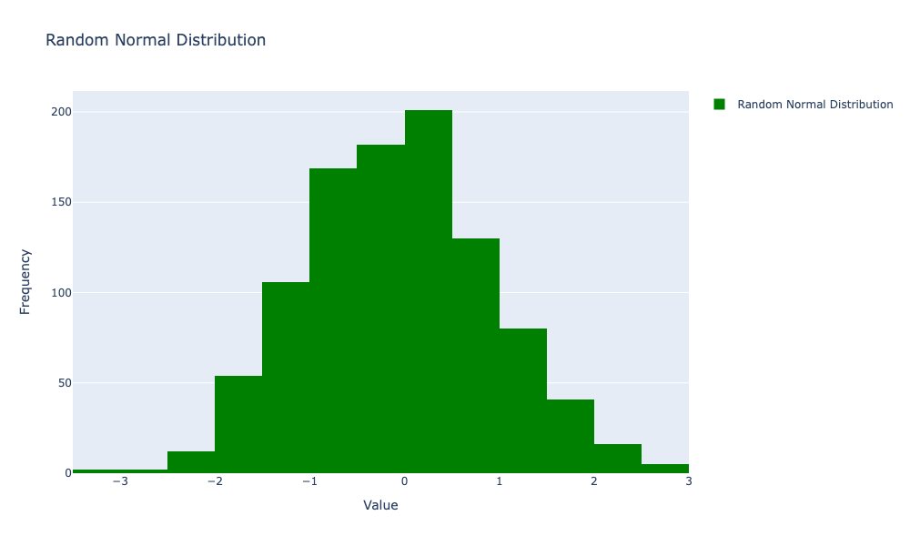
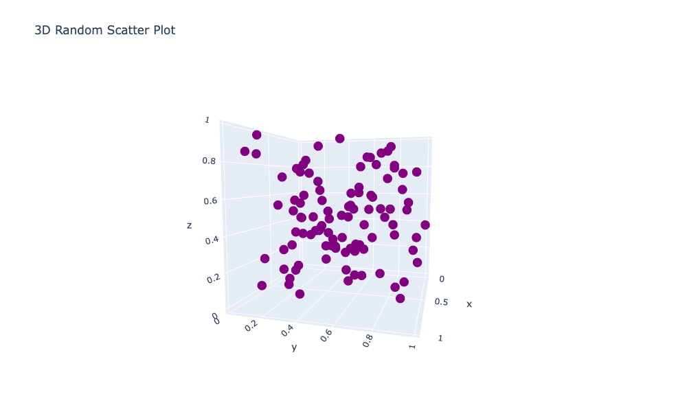

# tiny-plotly-wrapper
A tiny plotly wrapper which wraps the plotly api so it looks like matplotlib's api
## quickstart
```bash
git clone https://github.com/AdamZettel/tiny-plotly-wrapper.git
cd tiny-plotly-wrapper
jupyter notebook
```
## line plot


## scatter plot


## bar chart


## histogram


## 3D scatter plot

